# Forecasting and reconstructing monthly methane and carbon dioxide flux at Marcell Bog Lake Peatland (2009 to 2024)

A study of an eddy covariance tower in a poor fen in northern Minnesota, asking how far monthly flux can be predicted from what the site records. Statistical and machine learning methods are compared against seasonal benchmarks at horizons of one to twelve months, and relationships fitted on the measured years are projected backward into the two decades before measurement began. Both directions run into the same limit: the seasonal pattern of emission repeats reliably, the size of the season varies without trend, and none of the covariates recorded here predicted that variation once the seasonal cycle was accounted for.

That year-to-year variation is not a minor residual. Bousquet et al. (2006) attribute 70 percent of global methane emission anomalies between 1984 and 2003 to interannual variability in wetland emissions, which is the standing term for the quantity this study finds unpredictable at one site.

This repository rebuilds an earlier analysis of the same site. What changed and why is recorded in `notes/`.

---

## The site

The tower stands at AmeriFlux **US-MBP**, Marcell Bog Lake Peatland, at 47.5051° N and 93.4893° W, within the USDA Forest Service Marcell Experimental Forest in northern Minnesota. The site appears in the older literature as Bog Lake Fen. Data come from the AmeriFlux BASE product, Version 5-5, DOI [10.17190/AMF/1767835](https://doi.org/10.17190/AMF/1767835), released under CC-BY-4.0.

The peatland is a poor fen, fed by groundwater that has contacted mineral soil but only weakly so, and the National Wetlands Inventory maps 35.7 hectares of continuously saturated organic-soil wetland around the tower. Mean annual temperature is 3.4 °C, mean annual precipitation 780 mm, and snow covers the ground for roughly 120 days a year. Methane has been measured since 2009 and carbon dioxide since 2007, while hydrological and meteorological records from the experimental forest extend back to 1990.

Methane emission here follows the calendar far more closely than the clock. Time of day accounts for 0.97 percent of half-hourly variance and month of year for 37.4 percent, so monthly averaging discards very little. Carbon dioxide is governed by photosynthesis and respiration and varies strongly through the day, so its monthly means are computed with every hour equally weighted; without that correction roughly 62 percent of its apparent seasonal cycle would reflect the hours the instrument happened to sample.

The tower also sees only part of its surroundings. Flux arriving from bearings between 30° and 200° is discarded before publication, because those directions carry the surrounding upland forest into the measurement footprint. Across the study window that sector holds 40 percent of all half-hours. What the record contains is emission measured when the wind came off the peatland.

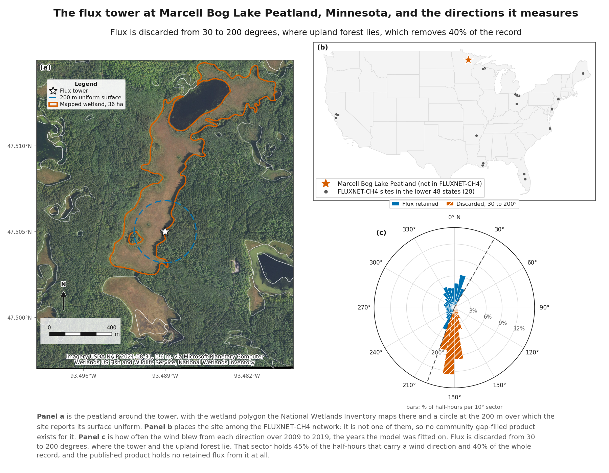

The study's boundaries are set by what exists rather than by design. Air temperature and precipitation stop at the end of 2019, which ends the months a model can be fitted on and leaves 60 months of methane the tower recorded but no model here can use. Forecasting cannot begin until 48 months of flux have accumulated, which took 62 calendar months for methane because of gaps in 2013 and 2014.

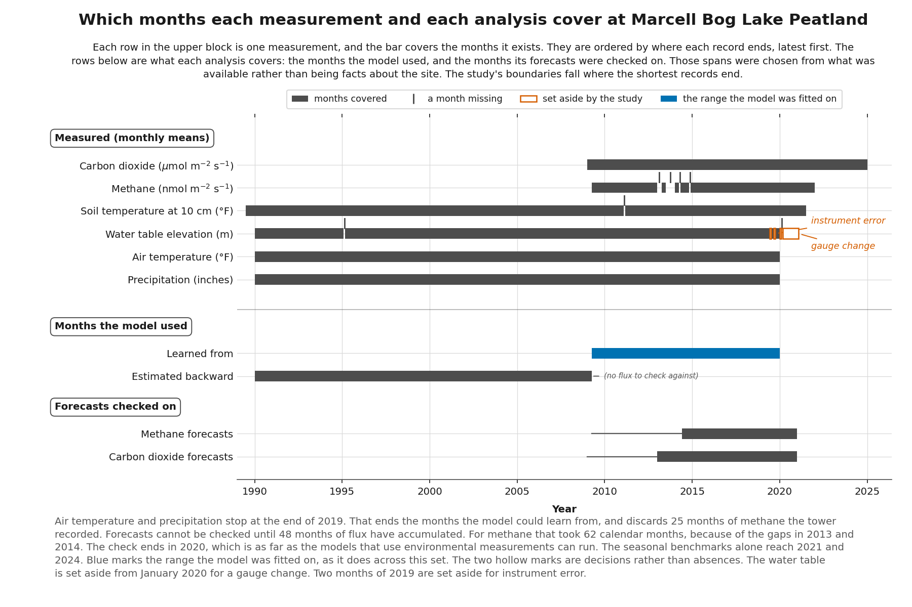

---

## Building the record

The BASE product carries three methane columns: one site-aggregated series and two replicates covering 2015 to 2018, which are the years the aggregated column is empty. Those replicates are two analyzers that operated in parallel on a single sonic anemometer, one closed-path and one open-path, and the pipeline merges all three columns into a single series recording which instrument produced each value.

The file itself carries no instrument metadata, so the identification rests on statistics published for this site. On the 9,045 timestamps where both analyzers reported, the median difference between them comes out at 0.130 nmol m⁻² s⁻¹ against a published 0.1, and the interquartile range at 8.645 against a published 8.2. The paired differences follow a Laplace distribution over a Gaussian by a margin of 7,028 in the Akaike information criterion. That result concerns differences between two instruments; whether the model's own errors follow the same distribution is a separate question, tested below, and the answer is different.

Aggregation preserves the evidence behind each value. A day contributes a mean only where at least eight valid half-hours support it, and every monthly value carries its observation count, standard deviation and standard error, so a month built from two measurements remains distinguishable from one built from several hundred.

Integrating the months that were observed, with no inference about the ones that were not, recovers 75.6 to 100.7 percent of published annual budgets across six comparable years. The agreement is close for 2015 to 2017, within 0.8 to 6.4 percent of Deventer et al. (2019). It falls 16 to 24 percent short for 2009 to 2011 against Olson et al. (2013), which gap-filled.

---

## What the record looks like

Each gas separates cleanly into a seasonal cycle that repeats and a residual that does not. The repeating shape accounts for 74 percent of the variance on methane and 71 percent on carbon dioxide, and what it leaves is 0.51 of methane's spread and 0.53 of carbon dioxide's, so the residual is half the variation rather than a remainder.

The size of the season is what varies. Methane's swing from lowest to highest month runs 33.7 to 150.6 across the years, a factor of 4.5, and carbon dioxide's 0.8 to 2.4, a factor of 3.0. Neither shows a trend (p = 0.215 and 0.505), so neither is drifting in a direction that could be extrapolated. Delwiche et al. (2021) report this quantity as a standard deviation on the annual mean, which is the form to use for comparison across sites; the fold-range above is the more legible form for one.

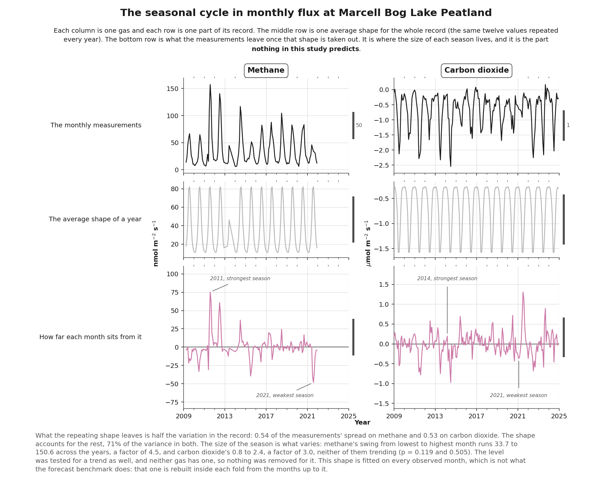

---

## Forecasting

Four methods were compared, each run with and without lagged environmental covariates, against four simple benchmarks, at horizons of one to twelve months on both gases. Every method was evaluated on rolling origins and scored on the same months, so the comparison rests on common ground throughout.

Nothing beat month-of-year climatology at any horizon on either gas. Predicting each month as the average of that month across the training years, the seasonal average referred to throughout, reduces scaled error by 23 to 28 percent on methane against repeating last year's same month. Fitted methods post a lower scaled error in three of the eight gas-and-horizon combinations: at one month on both gases, where on carbon dioxide all eight of them do, and at six months on methane. None does so by a margin that survives correcting for the overlap between rolling forecasts. At three, six and twelve months the fitted envelope's upper edge rises above the significance band, meaning some fitted methods are measurably worse than the seasonal average.

The sharper form of that result is what climatology does across horizons rather than at any one of them. Its error barely changes between one month and twelve on either gas, because it uses no recent information at all. Persistence, which uses nothing else, does the opposite: it holds up only at the shortest horizon and collapses as the horizon lengthens, recovering at twelve months only because a value twelve months old is the same month a year earlier, which makes it the seasonal benchmark rather than a recent one. Nothing recent carries far enough forward to be worth having.

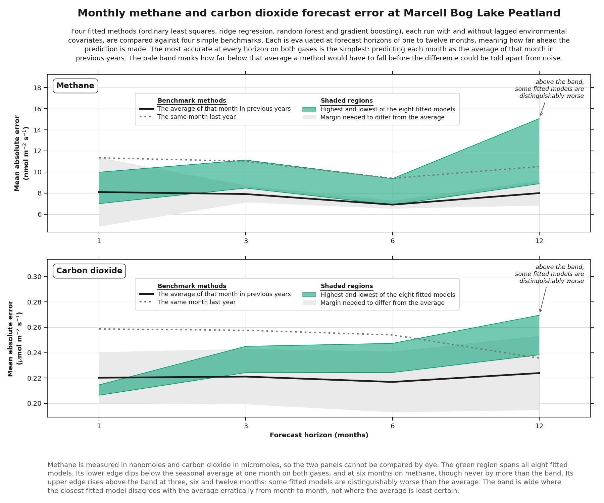

The methods get the timing of the season right and miss its size. In 12 of the 57 evaluated methane months the measured flux fell below every fitted model, and in 9 of those below the seasonal average too. July 2015 is the clearest case: the seasonal average predicted 94 nanomoles and the tower measured 40.

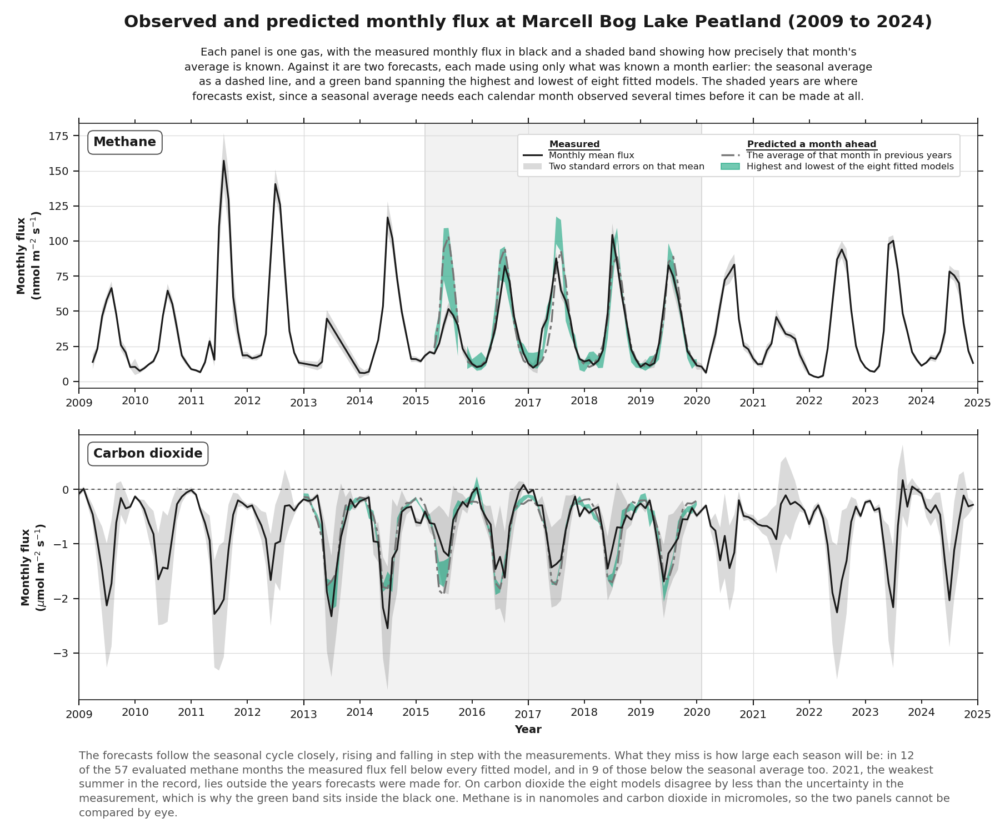

The covariates explain why nothing improved on the average. Feature selection ran inside every evaluation fold, and what survived was almost always temperature, which at this site is largely a restatement of the season: 95 percent of soil and air temperature is predictable from the date alone. Lagging recovers nothing independent, since a six-month lag on an annual cycle inverts its phase and a twelve-month lag restores it. For carbon dioxide three months ahead, no environmental covariate survived selection in any fold.

Water table behaves differently and arrives at the same place. The calendar explains 3.8 percent of it on methane and 6.0 percent on carbon dioxide, so it carries information the seasonal cycle does not. On methane it is also the measurement the models chose least often. That ordering holds at the top of the ranking on both gases and breaks at the bottom on carbon dioxide, where precipitation is chosen less than water table despite the calendar explaining far more of it.

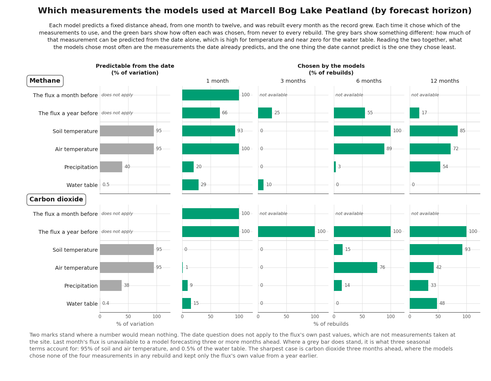

Error does not depend on which year is being predicted. The methods miss by similar amounts across every evaluated year, though the direction of the miss varies from year to year. Methane in 2015 is the one exception, and it differs twice over: its months run 17 to 52 where the evaluated record runs 10 to 104, so a season with no large months puts its points entirely in the lower half of the axis, and those months are also missed about 1.7 times as badly as months of the same size across the record.

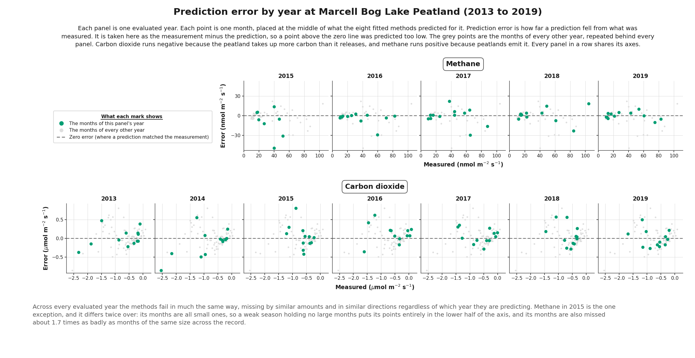

---

## Reconstruction

Environmental records reach back to 1990 while flux begins in 2009, so relationships fitted on the measured years can be projected into the earlier period.

The temperature response projects well. Fitting flux as an exponential function of soil temperature gives a Q10 of 2.41 weighted and 2.56 unweighted, both inside the interval of 1.9 to 4.3 measured independently at this site, and all sixteen holdout fits fall inside that interval too.

The water table term does not project, and the reason is where the fitted months sit. Water table at this site declined through the 2000s and the flux record opens in 2009, after that decline had run its course. The fitted range spans 0.33 m; the reconstruction runs 0.29 m above its upper edge, so the excursion is nearly as wide as the whole fitted span. Of the 230 months the reconstruction covers, 107 sit above the highest water table the model ever observed, arriving in unbroken runs of 44, 22 and 21 months.

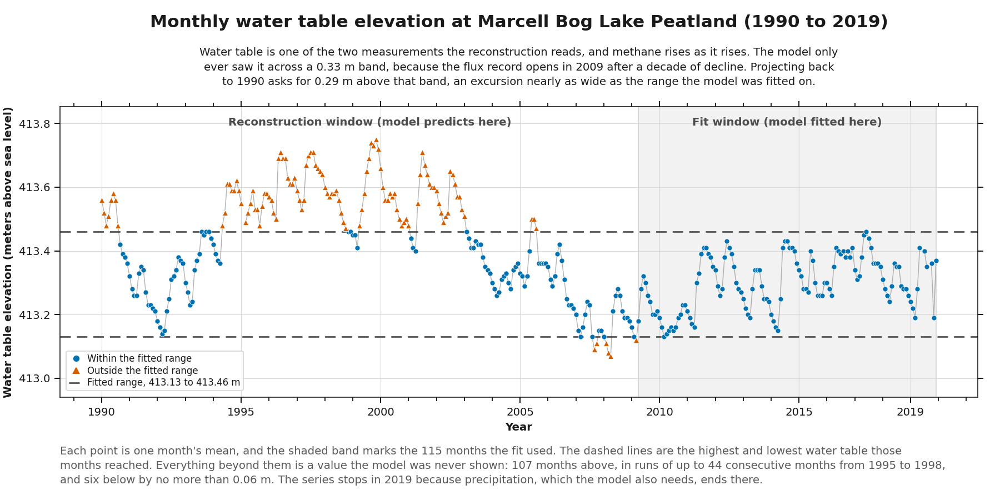

Refitting on progressively drier subsets shows the coefficient describing the months it was fitted on rather than the peatland. Across five fits, from all 115 months down to 69, it climbs from 2.704 to 4.077 weighted and from 2.385 to 3.299 unweighted. Soil temperature moves 16 percent along the same path when weighted and barely at all without.

No single step of that experiment is decisive on its own, since every step's interval overlaps the first. The evidence is the pattern: the coefficient rises at all four steps under both treatments and never once falls.

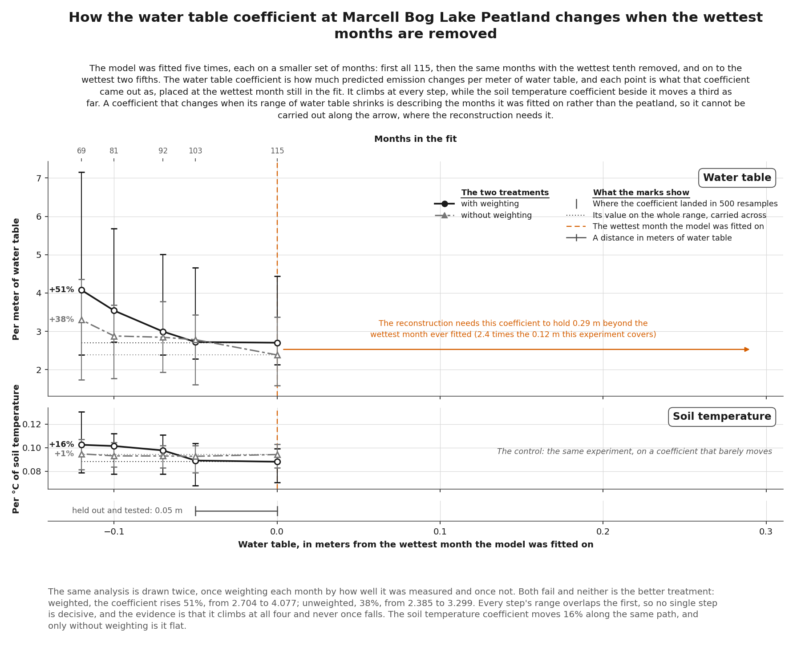

Projected back to 1990, three defensible treatments of the water table term beyond its fitted range produce annual estimates spanning 8 to 30 g C per square meter. They agree where the water table stays inside the fitted range and fan apart where it does not. Of the 19 reconstructed years, 17 have nothing to check against, since methane measurement stopped in 1992 and did not resume until 2009.

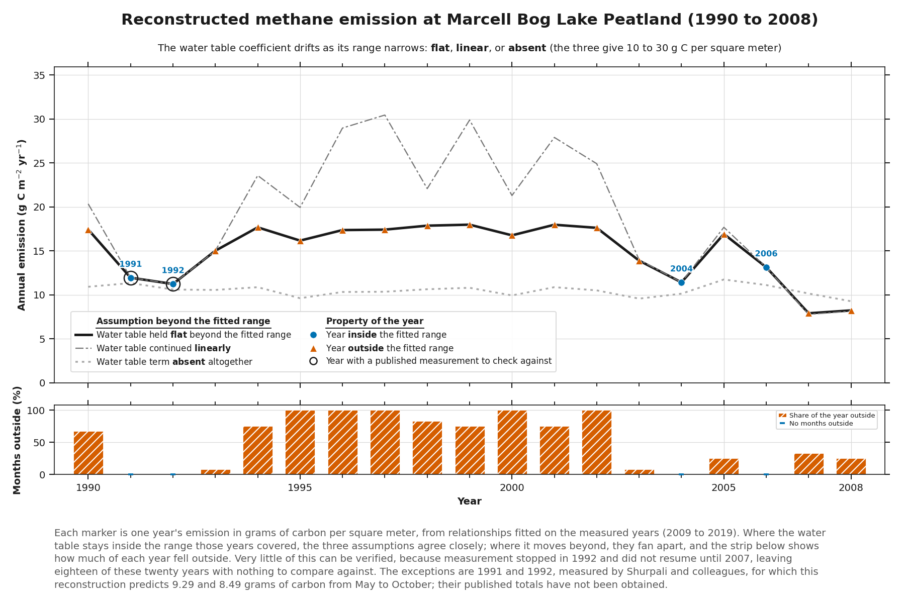

---

## Checking the estimator

The reconstruction models are fitted by least absolute deviations, which is optimal when errors follow a Laplace distribution and is why the study chose it. Tested directly against the model's own residuals, of the four panels exactly one has every point inside its band, and it is Laplace on the unweighted residuals. The two distributions cannot be told apart by fit there, with a difference of 0.31 in the Akaike information criterion against a conventional floor of 2.

The two weighted panels fail, but they test the weighting rather than the distribution. Inverse-variance weights at this site span a factor of 554 and do not track how the errors actually vary, and they reduce the effective sample size from 115 months to 42. That is an independent reason to distrust the weighted variant, arrived at from a different direction than the coefficient experiment.

The band drawn here is a simultaneous testing band, following Weine, McPeek and Abney (2023), rather than a confidence interval: it is a hypothesis test on the whole sample at once, which is why a single point outside it is decisive and why the pointwise level is 0.002079 rather than 0.05.

The published Laplace result came from comparing two instruments against each other on tens of thousands of paired differences, which is a different quantity from a fitted model's 115 residuals. That conflation is the second of its kind this project has caught, and it is recorded in `notes/study.md` with the first.

Least absolute deviations remains robust either way, and the study's intervals are empirical rather than distributional, so nothing downstream changes.

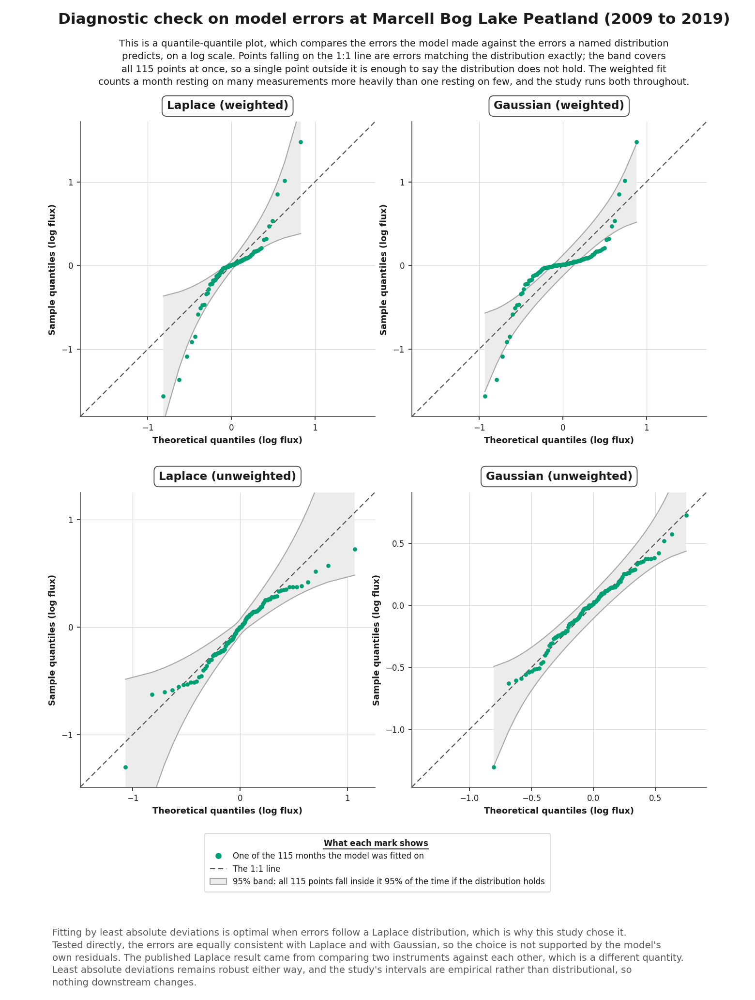

---

## What this study does not claim

**No gap-filling is performed.** The method chosen would determine most of an annual total, and establishing which method to trust is a separate question from the one asked here.

**The reconstruction is reported for what it reveals about its own limits**, not as an estimate to be used. Each reconstructed year carries the share of its months falling outside the fitted range alongside its value.

**Published comparisons are ranked by strength.** Shurpali et al. (1993) and Shurpali and Verma (1998) measured 1991 and 1992 and provide the only genuinely independent check available; their published totals have not been obtained. Olson et al. (2013) covers overlapping years but used the same backward-projection approach on a shorter flux record, so agreement with it would indicate consistent method rather than independent confirmation.

**Carbon dioxide is treated as a second series** testing whether the methane finding generalizes, and not as a co-equal half of the study.

**Scaled error is used within each gas and not across them,** because methane's scaling denominator is twice the difficulty of the period being scored while carbon dioxide's matches its test period closely.

**This site is absent from FLUXNET-CH4,** so no community gap-filled product exists for it and no gap-filled comparison is available.

---

## Running it

Requires Python 3.11, with dependencies pinned in `requirements.txt`.

```
python3 -m venv .venv
.venv/bin/pip install -r requirements.txt
```

The ingestion scripts are numbered because they are read in that order, not because each depends on the last. Any one runs alone, though `04` and `05` must each have run at least once before the study and forecast scripts, since they write the monthly series those read.

```
.venv/bin/python scripts/01_investigate_raw.py
.venv/bin/python scripts/02_build_monthly.py
.venv/bin/python scripts/03_verify_analyzers.py
.venv/bin/python scripts/04_merge_qc_aggregate.py
.venv/bin/python scripts/05_build_co2.py
```

The study and forecast scripts are unnumbered because they do not form a sequence. Each is independent with two exceptions: `make_figures.py` reads outputs written by `forecast_models.py` and `reconstruct.py`, and `model_examinations.py` reads outputs written by `forecast_models.py`, so both must run after it.

```
.venv/bin/python scripts/prepare_study.py
.venv/bin/python scripts/holdout_experiments.py
.venv/bin/python scripts/bias_and_validation.py
.venv/bin/python scripts/reconstruct.py
.venv/bin/python scripts/benchmark_forecasts.py
.venv/bin/python scripts/forecast_models.py
.venv/bin/python scripts/forecast_diagnostics.py
.venv/bin/python scripts/model_examinations.py
.venv/bin/python scripts/compare_base_products.py
.venv/bin/python scripts/make_figures.py
```

The test suite runs entirely offline on synthetic frames, reading no file in `CSVs/` or `data/`.

```
.venv/bin/python -m pytest tests
```

---

## Layout

```
CSVs/               primary source files and external references
data/processed/     pipeline output
figures/            generated figures
geodata/            imagery and boundaries for the site map
notes/              decisions, judgment calls, and what could not be resolved
scripts/            entry points
src/ingest/         half-hourly to monthly
src/study/          reconstruction and its diagnostics
src/forecast/       benchmarks, models and evaluation
src/validation/     comparison against the published BASE product
tests/              offline test suite
```

`notes/ingestion.md`, `notes/study.md` and `notes/base_v55.md` hold the substantive record: the reasoning behind every decision, the results that did not survive checking, and the questions that could not be resolved.

---

## Sources

Bousquet, P., et al. (2006). Contribution of anthropogenic and natural sources to atmospheric methane variability. *Nature* 443, 439–443.

Delwiche, K. B., et al. (2021). FLUXNET-CH4: a global, multi-ecosystem dataset and analysis of methane seasonality from freshwater wetlands. *Earth System Science Data* 13, 3607–3689.

Deventer, M. J., et al. (2019). Error characterization of methane fluxes and budgets derived from a long-term comparison of open- and closed-path eddy covariance systems. *Agricultural and Forest Meteorology* 278, 107638.

Irvin, J., et al. (2021). Gap-filling eddy covariance methane fluxes: comparison of machine learning model predictions and uncertainties at FLUXNET-CH4 wetlands. *Agricultural and Forest Meteorology* 308–309, 108528.

Knox, S. H., et al. (2021). Identifying dominant environmental predictors of freshwater wetland methane fluxes across diurnal to seasonal time scales. *Global Change Biology* 27, 3582–3604.

Li, M., et al. (2026). Machine-learning-based estimates of global natural vegetated wetland methane emissions (2000–2025). *Earth System Science Data* 18(5), 3507–3524.

Makridakis, S., Spiliotis, E., and Assimakopoulos, V. (2018). Statistical and machine learning forecasting methods: concerns and ways forward. *PLOS ONE* 13(3), e0194889.

Olson, D. M., et al. (2013). Interannual, seasonal, and retrospective analysis of the methane and carbon dioxide budgets of a temperate peatland. *Journal of Geophysical Research: Biogeosciences* 118, 226–238.

Roman, T., et al. (2025). AmeriFlux BASE US-MBP Marcell Bog Lake Peatland, Version 5-5.

Shurpali, N. J., and Verma, S. B. (1998). Micrometeorological measurements of methane flux in a Minnesota peatland during two growing seasons. *Biogeochemistry* 40, 1–15.

Shurpali, N. J., et al. (1993). Seasonal distribution of methane flux in a Minnesota peatland measured by eddy correlation. *Journal of Geophysical Research* 98, 20,649–20,655.

Weine, E., McPeek, M. S., and Abney, M. (2023). Application of equal local levels to improve Q-Q plot testing bands with R package qqconf. *Journal of Statistical Software* 106(10).
